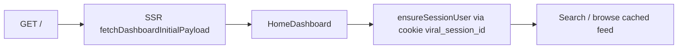
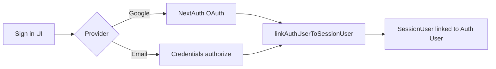
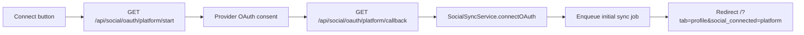

# User Flow

> Основные сценарии по коду и UI. См. также [[features]].

## 1. Anonymous → first visit

- Cookie `viral_session_id` создаётся автоматически (httpOnly, maxAge ~400 days)
- FREE grant tokens начисляются при первом billing ensure для auth user; anonymous — по `SessionUser`

## 2. Registration / login

- Sign-in page: `/` (NextAuth `pages.signIn`)
- Bridge сохраняет tokens, saved videos, chats на `SessionUser`

## 3. Search videos

1. User enters query on Home tab
2. Client → `POST /api/videos/feed` with `action: "search"`
3. Server: `loadAndPick` from `Video` table
4. If pool low: parallel YouTube ingest + TikHub Instagram ingest (throttled)
5. Results rendered in `SearchResultsSection`
6. "Load more" → `action: "more"` → spends 5 tokens

## 4. Save & script

1. Save video → `POST /api/saved-videos`
2. Open Scripts tab → create chat → add reference (saved or feed video)
3. Optional: transcribe video → `POST /api/videos/transcribe`
4. Generate → `POST /api/script-generator/generate` (spend 25 tokens, DeepSeek)

## 5. Competitors

1. Add competitor (YouTube URL / IG handle) → `POST /api/competitors`
2. Token charge on add (35) if applicable
3. View competitor videos; refresh reels (IG) → token charge
4. Daily sync job path → `competitor-daily-sync.ts`

## 6. Profile Hub — manual account

1. Navigate to Profile tab
2. Fill onboarding fields (usernames, niche) → `PATCH /api/user/profile`
3. Manual social row created in `UserSocialAccount` with `authMethod: manual`

## 7. Profile Hub — OAuth connect

Platforms: youtube, instagram, tiktok.

## 8. Billing upgrade

1. User opens `/billing` or Account panel
2. `GET /api/billing/me` — plan + balance
3. Create order → `POST /api/billing/orders`
4. Confirm payment → `POST /api/billing/orders/[id]/confirm` (**admin/manual today**)
5. Tokens granted via ledger

## 9. Trends sidebar

- Desktop/mobile `LiveTrendsSidebar` polls `GET /api/trends/realtime` every 120s when visible
- Lazy refresh deferred (sessionStorage gate 15 min)

## Tab routing

- URL param `?tab=home|competitors|saved|scripts|profile` via `dashboard-tab-url.ts`
- All tabs stay mounted (`hidden`), not unmounted — scroll/state preserved

## Связанные документы

- [[architecture]]
- [[frontend]]
- [[authentication]]
- [[instagram]]
- [[youtube]]
