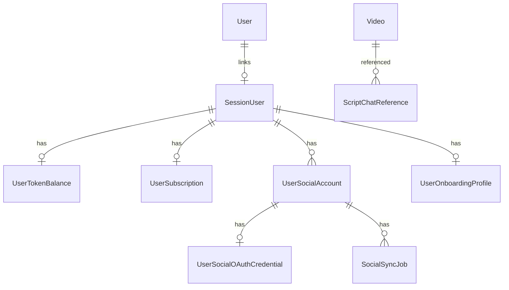

# Schema

> Полная схема: `prisma/schema.prisma`. Этот документ — группировка и ключевые поля.

## Video

Central content table for feed and script references.

- Unique: `[platform, externalId]`
- Platforms: `youtube`, `instagram` (and others as stored)
- Scoring: `rating`, `viralScore`, `relevanceScore`, `engagementRate`
- Transcript: `transcriptText`, `transcriptStatus`, `transcriptSource`

## SessionUser

App user row — tokens, saved videos, chats, competitors, social accounts.

- `sessionKey` — UUID in cookie `viral_session_id`
- `authUserId` — optional link to NextAuth `User`

## UserSocialAccount

Connected or manual social profile per platform.

| Field | Values / notes |
|-------|----------------|
| `platform` | instagram, tiktok, youtube |
| `authMethod` | manual, oauth |
| `connectionStatus` | disconnected, pending_oauth, connected, error, revoked |
| `connectionHealth` | healthy, degraded, error, disconnected, revoked |
| `syncStatus` | idle, queued, running, failed |
| `updateStrategy` | polling, webhook, hybrid |
| `statsSource` | pending, api, … |

Unique: `[userId, platform]`.

## UserSocialOAuthCredential

Encrypted OAuth tokens (AES-256-GCM at app layer).

- `accessToken`, `refreshToken` — ciphertext
- `scopes`, `providerUserId`, `tokenExpiresAt`

## SocialSyncJob

Queue for profile/video/analytics refresh.

- `trigger`: initial, scheduled, manual, webhook, …
- `status`: pending, running, completed, failed, …
- `maxAttempts`: default 5

## Billing models

- `UserSubscription.plan`: FREE | TRIAL | PRO | BUSINESS
- `UserSubscription.status`: ACTIVE | TRIAL | CANCELLED | EXPIRED | PAST_DUE
- `TokenTransaction.type`: SUBSCRIPTION_GRANT | TRIAL_GRANT | FREE_GRANT | TOKEN_PACK | SPEND | REFUND | ADMIN_ADJUSTMENT
- `BillingOrder.status`: PENDING | PAID | CANCELLED | FAILED

## UserOnboardingProfile

Manual usernames and creator metadata before/without OAuth.

- `instagramUsername`, `tiktokUsername`, `youtubeChannel`
- `creatorType`, `contentNiches[]`, `referenceLinks[]`

## UserProfileAiAnalysis

AI report jobs (generation not implemented).

- `status`: pending, …
- `tokenCost`: default 500
- `reportJson`: nullable

## ER diagram (simplified)

## Связанные документы

- [[database]]
- [[migrations]]
- `prisma/schema.prisma`
